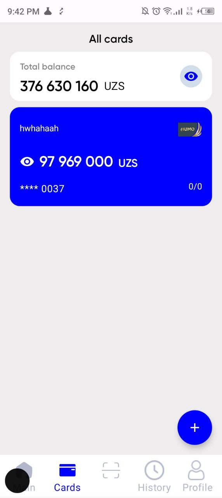
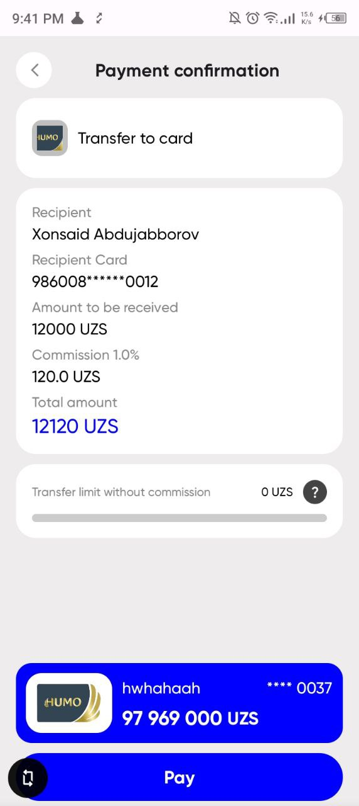
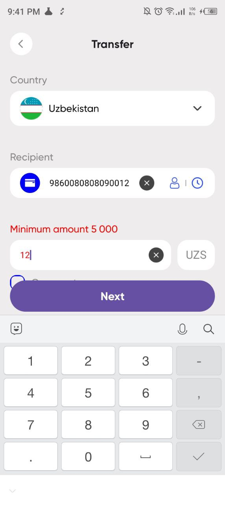
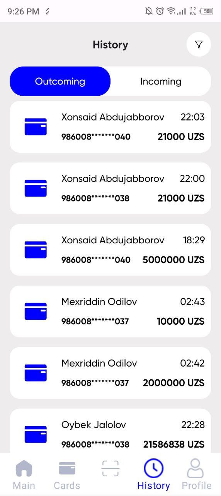
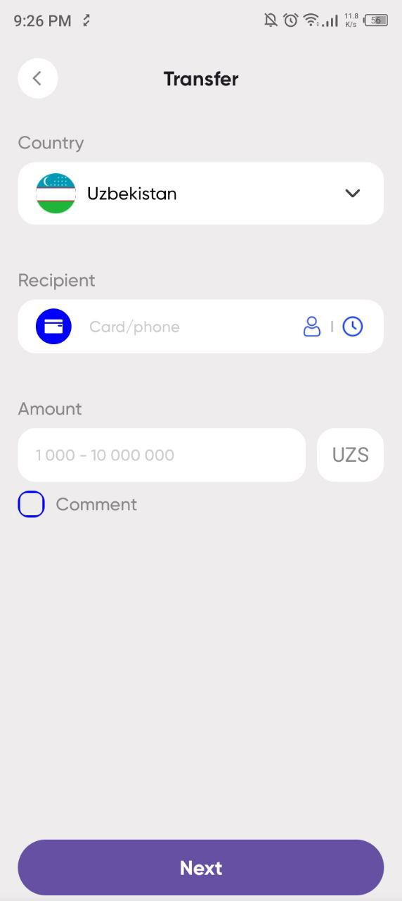
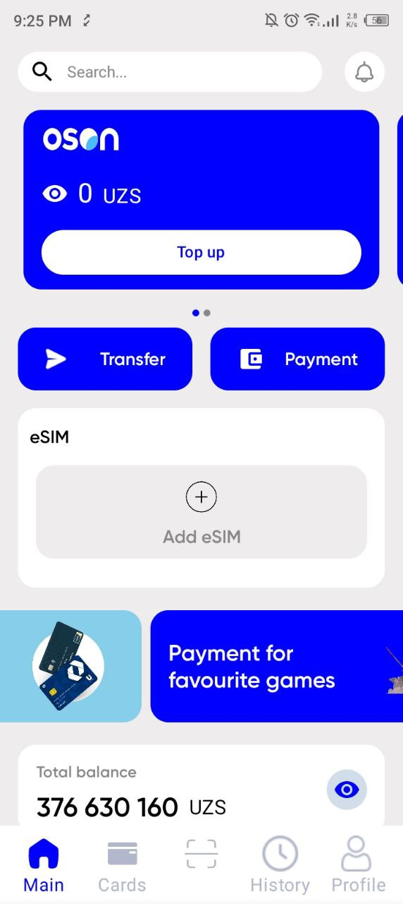

# 💳 Mobil Banking OSON (Android)

Welcome to the OSON Mobile Banking Clone repository! This is a native Android application that replicates the functionality of the OSON banking app. The app is built using modern Android development practices and follows a scalable architecture.

---

## 📱 App Overview

OSON is a mobile banking application that allows users to manage their accounts, perform transactions, and handle financial operations securely. This repository contains an OSON clone that includes essential banking functionalities such as user authentication, card management, transaction history, and profile management.

---

## ⚙️ Features

- **User Authentication** – Sign in, sign up, verification, and PIN code setup.
- **Card Management** – Add, delete, update, and read card details.
- **Transfers** – Secure money transfers, transfer verification, and last transfer tracking.
- **Transaction History** – View and manage past transactions.
- **Profile Management** – Update user information and settings.

---

## 🛠️ Technologies Used

- **Multi-Module Architecture** – Organizing the project for scalability and maintainability.
- **Retrofit (OKHttp, Authenticator, Access & Refresh Token)** – Efficient API handling and secure authentication.
- **Hilt** – Dependency injection for better code management.
- **Pagination** – Handling large sets of data efficiently.
- **Caching (Local & Retrofit)** – Optimized data loading for better performance.
- **Jetpack Compose** – Modern UI toolkit for building native UI.
- **MVI Architecture** – Ensuring a clean and reactive UI state management.
- **Voyager** – Navigation in Jetpack Compose.
- **OAuth2** – Secure user authentication and authorization.

---
## 📸 Screenshots

<table>
  <tr>
    <td></td>
    <td></td>
    <td></td>
    <td></td>
    <td></td>
    <td></td>
  </tr>
</table>

---